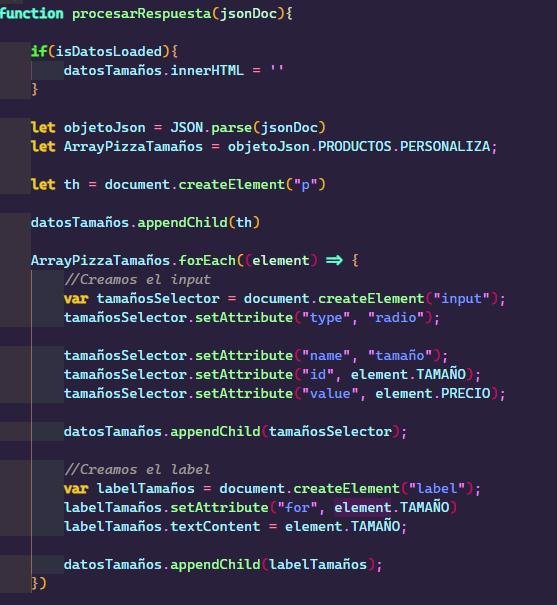
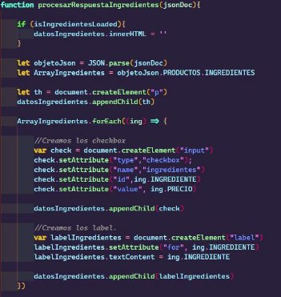
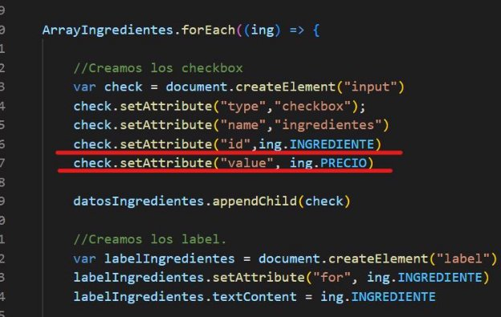
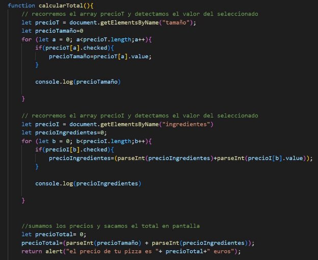
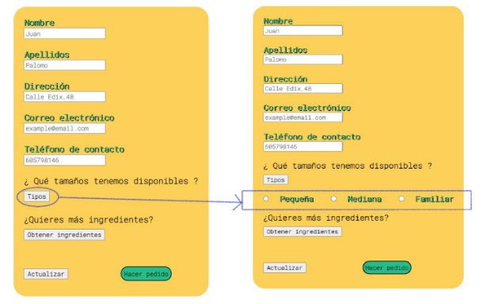
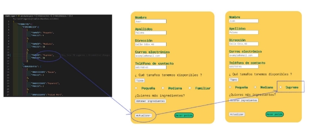
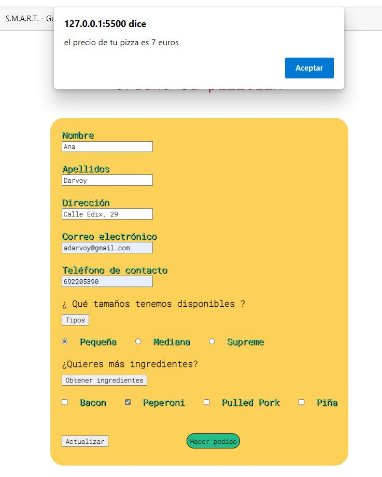
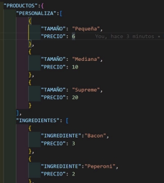
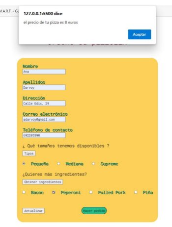



**AE-2. AJAX**

29/10/2022

**─**

Ana Darvoy David González Miguel Antón

**Visión general**

En este proyecto vamos a realizar de manera grupal, el desarrollo de dos requerimientos propuestos para esta actividad.

Respecto al primer requerimiento, se nos pide, partiendo del formulario realizado para la AE -1, simular un entorno de acceso a servidor para traer la información necesaria para cargar los tamaños e ingredientes de manera dinámica. Dicha información debe estar en formato JSON y ser tratada desde el cliente y se debe incluir un botón de refrescar.

Respecto al Requisito 2,  se debe acceder al servidor para traer los datos de precios y calcular el precio total de la pizza en base a estos.

**Objetivos**

1. Cargar los datos de un JSON de manera dinámica procesándolos desde el Cliente para mostrarlos.
1. Traer los datos de los precios de manera también dinámica para calcular el precio final del pedido.

**Especificaciones**

Se han dividido las tareas de manera que David y Ana han trabajado en el Requerimiento 1 y Miguel en el Requerimiento 2. En este caso, se ha decidido que cada miembro del equipo trabaje sobre una rama propia publicada en el repositorio común de GitHub y los cambios se han mergeado a master a través de Pull Requests, de manera que otro miembro del equipo validase el código antes de hacerse el merge.

Requerimiento 1:

Partimos de la base, de que hemos utilizado el formulario que hemos implementado en la actividad 1, realizada este trimestre.

En este caso, el requerimiento 1, consiste en aplicar un acceso a un servidor mediante AJAX. La base de datos simulada que tenemos, es un fichero JSON en el que hemos declarado los objetos que vamos a necesitar para construir nuestro formulario.

En primer lugar, tenemos que hacer la llamada al servidor e instanciar el objeto.

En esta función, vamos haciendo un control de cada uno de los procesos por lo que pasa para poder tener un mejor control de éste.

Una vez que el proceso ha finalizado, y la respuesta ha sido validada por el servidor, hacemos una llamada a la función que será encargada de crear los input de tipo radio y añadirle valor y texto.

***Función de llamada al servidor***

A continuación se muestra la función que será la encargada de crear los elementos anteriormente mencionados.

***Función encargada de crear los elementos y añadirles valor y texto***

Una vez que tenemos los datos de los tamaños cargados, tenemos que hacer la misma operación con los ingredientes.

***Función de petición.***

***Función de procesamiento de datos - Ingredientes.***

Para finalizar, tenemos un último paso, que es añadir un botón de refrescar. Para ello, lo que hemos implementado ha sido hacer una función que cargue los datos sólo los que han sido modificados. De esta manera, no tenemos que recargar todo el servidor y solo los que han tenido cambios.

Para poder hacer esto, al final de cada función de generación de datos, hemos igualado dicha función a true, para que los cargue en caso de ser necesario.

Por último, en nuestra app, hemos creado la función de window onload, que a parte de recoger los datos de la actividad 1 para su validación, hemos añadido los de generación de tamaños e ingredientes en el momento en el que pulsemos el botón.

Requerimiento 2:

En el requerimiento 2 se nos pedía acceder a la base de datos para obtener los precios y calcular el total.

En primer lugar debíamos obtener los precios tanto del tamaño como de los ingredientes, por lo que a la hora de recibir la respuesta del JSON debíamos añadir el value PRECIO, aunque no apareciese en pantalla.

El siguiente punto sería detectar cual de las opciones era la seleccionada y sacar el precio para sumarlo.Para ello hemos utilizado la función calcularTotal().

**función calcularTotal()**

Para cada elemento se recorre el array que obtenemos al buscar mediante el nombre(“tamaño” y “ingredientes”) para obtener cual está chequeada. Después le damos el valor del precio correspondiente a una variable que hemos declarado anteriormente. Ese precio lo obtenemos al poner el .value .En el precioIngredientes sumamos precioIngredientes al precio ya que podemos elegir varios ingredientes y se deben sumar entre ellos. Por último solo nos quedaría sumar  ambos precios y sacar un alert en pantalla con el precio total.

Esta función esta implementada con requerimientos de la primera actividad, por lo que ingredientes y tamaño tienen que estar seleccionados para que funcione.

**Test:**

**Test del requerimiento 1:**

1. Comprobamos que los tipos se cargan de forma dinámica:

2. Comprobamos que los Ingredientes se cargan de forma dinámica:

3. Comprobamos que el botón Actualizar refresca la info de Tipos e Ingredientes Modificamos el json y hacemos click sobre el botón  “Actualizar”

**Test requerimiento 2:**

\1. Comprobamos que al pulsar el botón de procesar el pedido, la web mostrará el resultado del precio total de la pizza

Nos devuelve un precio de 7 Euros : 5€ de base tamaño pequeño + 2€ de Pepperoni

Modificamos el precio de la base pequeña en el json

y nos devuelve un precio de 8€: 6€ de base tamaño pequeño + 2€ de Pepperoni

**Repositorio GitHub:**

https://github.com/DavidGRamiro/DWEC-Ajax
